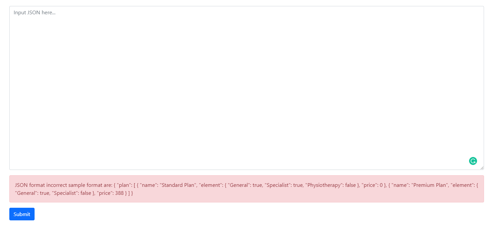
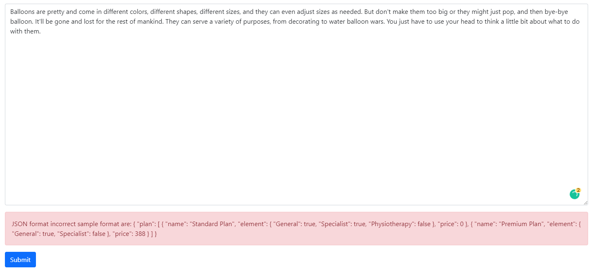

# Introduction

To create and choose plan by users' input.
[Demo Link](https://chakyiu.github.io/react-fe-plan-demo/index)

# Instruction

1. Clone the project and run `npm install` and `npm run start` under the root folder.
2. Run `npm run build` and pull all data in `./build` to static server.
3. Config home page under `./package.json` and run `npm run deploy`

# Unit test

0. Layout showcase

Empty Field: 
Error Input:  (When submit button is clicked during error input, it will have shaking animation to alert user.)
Correct Input: 
Plan Page: 

1. Acceptable and sample input format:

```json
{
  "plan": [
    {
      "name": "Standard Plan",
      "element": {
        "General": true,
        "Specialist": true,
        "Physiotherapy": false
      },
      "price": 0
    },
    {
      "name": "Premium Plan",
      "element": {
        "General": true,
        "Specialist": false
      },
      "price": 388
    }
  ]
}
```

Result: 

2. More than three plans inputed:

```json
{
  "plan": [
    {
      "name": "Standard Plan",
      "element": {
        "General": true,
        "Specialist": true,
        "Physiotherapy": false
      },
      "price": 0
    },
    {
      "name": "Premium Plan",
      "element": {
        "General": true,
        "Specialist": false
      },
      "price": 388
    },
    {
      "name": "Premium Plan",
      "element": {
        "General": true,
        "Specialist": false
      },
      "price": 388
    },
    {
      "name": "Premium Plan",
      "element": {
        "General": true,
        "Specialist": false
      },
      "price": 388
    },
    {
      "name": "Premium Plan",
      "element": {
        "General": true,
        "Specialist": false
      },
      "price": 388
    },
    {
      "name": "Premium Plan",
      "element": {
        "General": true,
        "Specialist": false
      },
      "price": 388
    }
  ]
}
```

Result: 

3. Empty JSON

```json
{}
```

Result:  4. Empty Plan

```json
{
  "plan": []
}
```

Result: 

5. Plan with no "Name"

```json
{
  "plan": [
    {
      "element": {
        "General": true,
        "Specialist": true,
        "Physiotherapy": false
      },
      "price": 0
    }
  ]
}
```

Result: 

6. Plan with no "Element"

```json
{
  "plan": [
    {
      "name": "Standard Plan",
      "price": 0
    }
  ]
}
```

Result: 

7. Plan with no "Price"

```json
{
  "plan": [
    {
      "name": "Standard Plan",
      "element": {
        "General": true,
        "Specialist": true,
        "Physiotherapy": false
      }
    }
  ]
}
```

Result: 

8. Responsive layout


 (For too many plans inputed, the plan list can be scolled horizontally.)
